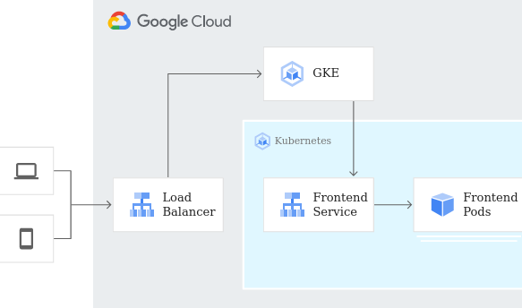

# Trabajo de Fin de Grado Superior en Administración de Sistemas: Uso de Terraform y Google Kubernetes Engine


Para ejecutar terraform con la cuenta de servicio:

docker run -it --rm -w /app -v $(pwd):/app --env-file=.env --entrypoint sh hashicorp/terraform:1.3.0


- [Introducción](#introducción)
- [Metodología](#metodología)
- [Implementación](#implementación)
- [Resultados](#resultados)
- [Conclusión](#conclusión)
- [Referencias](#referencias)
- [Ejemplo](#Ejemplo)

## Introducción

En la actual era de la digitalización, la administración eficiente de sistemas y recursos informáticos es de suma importancia. Las empresas de todo el mundo dependen cada vez más de infraestructuras sólidas y seguras para sus operaciones diarias, y la demanda de soluciones eficientes y escalables sigue creciendo. Para abordar este reto, este proyecto de Trabajo de Fin de Grado Superior en Administración de Sistemas se enfoca en la investigación y aplicación de Terraform y Google Kubernetes Engine (GKE), dos herramientas prominentes en el ámbito de la administración de sistemas.

Terraform es una herramienta de infraestructura como código (IaC) que permite a los usuarios definir y proporcionar centros de datos utilizando una sintaxis de alto nivel, lo que simplifica la gestión y orquestación de recursos de infraestructura. GKE, por otro lado, es un servicio de administración de Kubernetes que simplifica la implementación, administración y escalado de aplicaciones contenerizadas.

La meta de este proyecto es demostrar el uso de estas herramientas para implementar una infraestructura en la nube que hospeda un servidor de WordPress y una base de datos de MariaDB, ambas desplegadas en un cluster de GKE. A través de este proceso, se exploran las capacidades de estas tecnologías para automatizar y simplificar la administración de sistemas.

Además, para facilitar el acceso a los Pods de Kubernetes y proporcionar una interfaz amigable para el usuario, se implementa un balanceador de carga. Esto permite visualizar el sitio web de WordPress y experimentar el resultado final de la infraestructura creada.


## Potencial

Terraform es una herramienta poderosa que ofrece diversas ventajas en la administración de infraestructuras en la nube. Algunas de las principales ventajas de utilizar Terraform incluyen:

1. **Infraestructura como código (IaC):** Terraform permite definir y gestionar la infraestructura de manera declarativa, utilizando código en lugar de configuraciones manuales. Esto proporciona un mayor control sobre la infraestructura y permite una gestión eficiente y reproducible.

2. **Orquestación y automatización:** Con Terraform, puedes definir y orquestar la creación, modificación y eliminación de recursos de infraestructura de manera sencilla. Puedes automatizar tareas repetitivas, lo que ahorra tiempo y reduce el riesgo de errores humanos.

3. **Multiplataforma y proveedor-agnosticismo:** Terraform es compatible con varios proveedores de servicios en la nube, lo que te permite desplegar y gestionar infraestructuras en diferentes entornos y proveedores de manera consistente. Puedes utilizar la misma sintaxis de Terraform para desplegar recursos en proveedores como AWS, Google Cloud, Azure y más.

4. **Despliegue en varios servidores en la nube:** Una de las características destacadas de Terraform es la capacidad de desplegar y gestionar infraestructuras en varios servidores en la nube de forma simultánea. Puedes definir y mantener recursos en diferentes proveedores y regiones de manera centralizada, lo que brinda flexibilidad y escalabilidad.

Al combinar Terraform con servicios como Google Kubernetes Engine (GKE), puedes aprovechar aún más el potencial de la herramienta. GKE simplifica la implementación, administración y escalado de aplicaciones contenerizadas, proporcionando un entorno robusto para ejecutar tus servicios. Puedes utilizar Terraform para definir y orquestar tanto la infraestructura subyacente como el despliegue de tus aplicaciones en GKE, lo que permite una administración completa y automatizada de todo el ciclo de vida de tu infraestructura en la nube.

En conclusión, Terraform ofrece un potencial significativo en la administración de sistemas al proporcionar una forma declarativa de definir y gestionar infraestructuras en la nube. Su capacidad para desplegar en varios servidores en la nube, combinado con herramientas como GKE, permite construir y mantener infraestructuras escalables y eficientes en entornos de nube heterogéneos.


## Metodología


El proyecto se desarrolló utilizando un enfoque sistemático y paso a paso para asegurar un despliegue exitoso y eficiente de la infraestructura.

1. **Planificación e investigación:** El primer paso fue comprender a fondo el funcionamiento de las herramientas a utilizar: Terraform y Google Kubernetes Engine (GKE). Se estudiaron sus documentaciones, se exploraron tutoriales y se investigaron mejores prácticas para su implementación. 

2. **Diseño de la infraestructura:** A continuación, se diseñó la infraestructura de red, teniendo en cuenta los requisitos de las aplicaciones a desplegar (servidor WordPress y base de datos MariaDB). Este diseño incluyó la planificación de la red y las subredes, así como la configuración del cluster de GKE.

3. **Codificación con Terraform:** Con el diseño de la infraestructura listo, se procedió a codificar esta configuración en Terraform. Se crearon varios archivos .tf para cada componente de la infraestructura, cada uno responsabilidad de una parte específica de la creación de la red, la subred o el cluster.

4. **Implementación de las aplicaciones en GKE:** Una vez que la infraestructura de red estaba lista, se utilizaron archivos manifest .yaml para desplegar el servidor WordPress y la base de datos MariaDB en el cluster de GKE. Estos archivos definen el estado deseado de los recursos de Kubernetes, lo que permite un despliegue consistente y reproducible de las aplicaciones.

5. **Creación del balanceador de carga:** Con las aplicaciones funcionando correctamente en el cluster, se creó un balanceador de carga para gestionar el tráfico hacia los Pods de Kubernetes y proporcionar un acceso fácil al sitio web de WordPress.

6. **Pruebas y validación:** Por último, se realizaron pruebas exhaustivas para validar el funcionamiento correcto de todo el sistema. Esto incluyó pruebas de conectividad, pruebas de rendimiento, y pruebas de escalabilidad.

A través de este proceso metodológico, se pudo implementar una infraestructura de red robusta y eficiente que cumple con los objetivos del proyecto.


### Terraform

La implementación comienza con la creación de la infraestructura necesaria utilizando Terraform. Los archivos de Terraform que definen la red virtual y la subred se pueden encontrar en el repositorio:

- [Archivo de la Red](/modules/vpc/main.tf)
- [Archivo del cluster](/modules/gke/main.tf)
- [Archivos despligue pods](/modules/manifest/)


## Conclusión

A lo largo de este Trabajo de Fin de Grado Superior, hemos demostrado la versatilidad y eficacia de Terraform y Google Kubernetes Engine en la creación y gestión de infraestructuras en la nube. Hemos llevado a cabo un despliegue completo de una red, una subred, un clúster de GKE y aplicaciones contenidas, específicamente un servidor de WordPress y una base de datos MariaDB.

El uso de Terraform permitió una gestión de la infraestructura eficiente y reproducible. Con su sintaxis declarativa, pudimos definir y crear nuestra infraestructura de red con precisión. 

GKE, por otro lado, se mostró como una solución robusta y escalable para la orquestación de contenedores. La creación del clúster y el despliegue de las aplicaciones se llevó a cabo de manera sencilla y eficiente, lo que permitió un control granular sobre los recursos y una excelente escalabilidad.

El uso combinado de estas dos poderosas herramientas proporciona una solución completa para la creación, despliegue y gestión de aplicaciones en la nube. Este proyecto ha demostrado que, con el enfoque correcto y las herramientas adecuadas, es posible construir una infraestructura en la nube robusta y escalable de forma eficiente.

En resumen, este proyecto ha sido una oportunidad para explorar y aplicar las capacidades de Terraform y GKE en un escenario real. Los resultados obtenidos demuestran el potencial de estas herramientas para simplificar y optimizar la administración de sistemas en la nube. 

## Ejemplo

Pequeño ejemplo de un despliegue de 2 contenedores de cloudrun con red interna :

```
provider "google" {
  credentials = file("credentials.json")
  project     = var.id
  region      = "europe-west2"
}

resource "google_compute_network" "vpc_network" {
  name = "terraform-network"
}

# Permite conectarse 
resource "google_compute_firewall" "default" {
  name    = "terraform-allow-ssh" 
  network = google_compute_network.vpc_network.name

  allow {
    protocol = "tcp"
    ports    = ["22"]
  }

  source_ranges = ["0.0.0.0/0"]
}

#permite comando ping
resource "google_compute_firewall" "icmp" {
  name    = "terraform-allow-icmp"
  network = google_compute_network.vpc_network.name

  allow {
    protocol = "icmp"
  }

  source_ranges = ["0.0.0.0/0"]
}


resource "google_compute_instance" "vm_instance" {
  count        = 2
  name         = "terraform-instance-${count.index}"
  machine_type = "f1-micro"
  zone         = "europe-west2-a"

  boot_disk {
    initialize_params {
      image = "debian-cloud/debian-11"
    }
  }

  network_interface {
    network = google_compute_network.vpc_network.name

    access_config {
      // Include this section to give the VM an external IP address
    }
  }

  metadata_startup_script = "apt-get update && apt-get -y install inetutils-ping"
}
```


